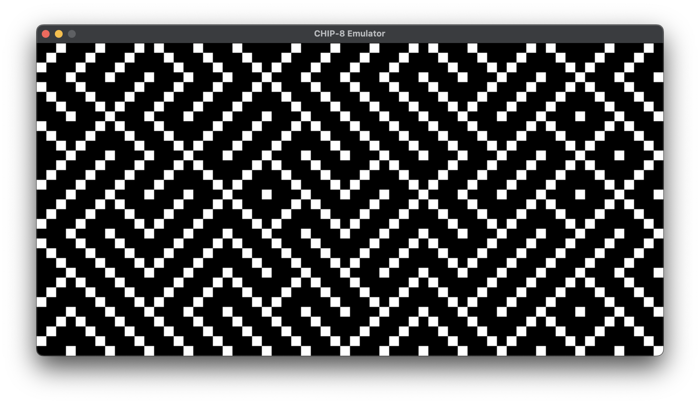
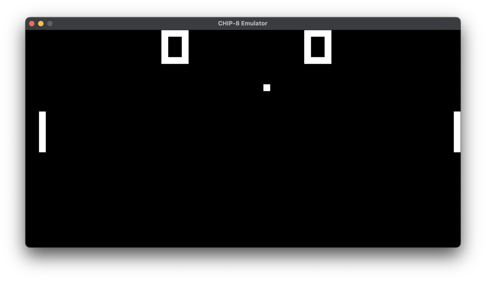
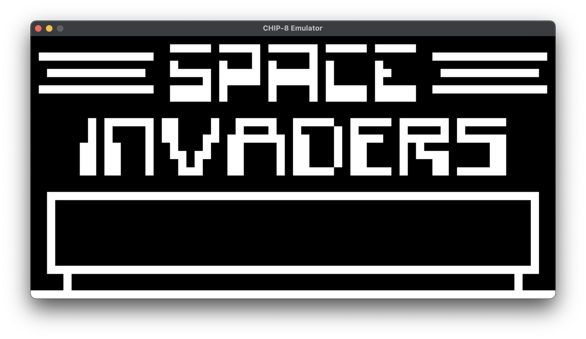

# CHIP-8 Interpreter

This project is a CHIP-8 emulator written in Go. The CHIP-8 is an interpreted programming language, developed by Joseph Weisbecker, used on some early computers. This emulator can load and run CHIP-8 ROMs, providing a graphical and audio interface for the games.

## Table of Contents

- [Features](#features)
- [Installation](#installation)
- [Usage](#usage)
- [Project Structure](#project-structure)

## Features

- Emulates the CHIP-8 CPU and its instructions.
- Loads and runs CHIP-8 ROMs.
- Provides graphical output using SDL2.
- Handles input from the keyboard.
- Plays sound using SDL2.

## Installation

### Prerequisites

- Go (version 1.13 or higher)
- SDL2 library

### Steps

1. Clone the repository:

```sh
git clone https://github.com/rinald/chip8.git
cd chip8
```

2. Install SDL2:

- **macOS**: `brew install sdl2`
- **Ubuntu**: `sudo apt-get install libsdl2-dev`
- **Windows**: Download and install from the [SDL2 website](https://www.libsdl.org/download-2.0.php).

3. Build the project:

```sh
go build -o chip8 main.go
```

## Usage

1. Run the emulator with a CHIP-8 ROM:

```sh
./chip8 -rom roms/pong.ch8 -delay 2
```

2. Use the following keys to interact with the emulator:

```
1 2 3 4
Q W E R
A S D F
Z X C V
```

3. Press `ESC` to quit the emulator.

## Project Structure

```
chip8/
├── cpu/
│   ├── cpu.go
│   ├── decode.go
│   └── instructions.go
├── graphics/
│   ├── audio.go
│   ├── graphics.go
│   └── render.go
├── rom/
│   └── rom.go
├── main.go
└── README.md
```

- **cpu/**: Contains the CPU implementation and instruction decoding.
- **graphics/**: Handles graphics rendering and audio playback using SDL2.
- **rom/**: Manages loading of CHIP-8 ROM files.
- **main.go**: The entry point of the emulator.

## Screenshots




